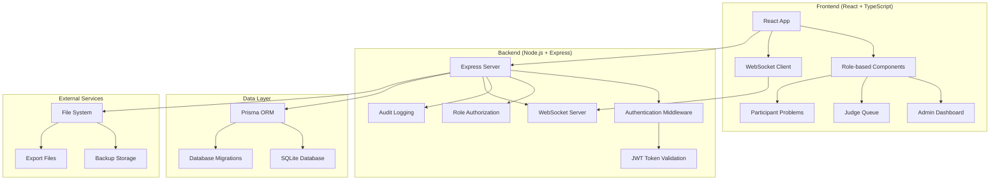

# Design Document

## Overview

The CodeStorm platform is a comprehensive competitive programming system built with a React frontend and Node.js/Express backend using Prisma ORM with SQLite. The system currently has a basic implementation that needs to be extended to match the comprehensive database schema and role-based permission system outlined in the requirements.

The platform supports three primary user roles:
- **Admin**: Full system control including contest management, user administration, and analytics
- **Judge**: Submission review and scoring capabilities  
- **Participant**: Problem solving and submission tracking

The design follows a modern web architecture with RESTful APIs, WebSocket integration for real-time updates, and a component-based React frontend using shadcn/ui components.

## Architecture

### System Architecture



### Database Architecture Evolution

The current Prisma schema needs significant expansion to support the comprehensive permission system and additional entities:

**Current Schema Gaps:**
- Missing hierarchical permission system (Permission, RolePermission tables)
- No contest management (Contest, ContestUser, ContestProblem tables)
- Limited analytics and leaderboard support
- Missing audit logging with permission tracking
- No attendance or backup management
- Simplified user model without PC codes and IP tracking

**Migration Strategy:**
1. Extend existing models with additional fields
2. Add new models for permissions, contests, and analytics
3. Create junction tables for many-to-many relationships
4. Implement data migration scripts for existing data

## Components and Interfaces

### Backend API Structure

#### Authentication & Authorization Layer
```typescript
interface AuthMiddleware {
  authenticateToken(req: Request, res: Response, next: NextFunction): void;
  authorizePermissions(permissions: number[]): MiddlewareFunction;
  checkHierarchicalPermissions(permission: number, userId: string): Promise<boolean>;
}

interface PermissionService {
  getUserPermissions(userId: string): Promise<Permission[]>;
  checkPermission(userId: string, permissionCode: number): Promise<boolean>;
  getInheritedPermissions(permissionId: string): Promise<Permission[]>;
}
```

#### Core API Controllers

**User Management Controller**
```typescript
interface UserController {
  // Authentication
  login(credentials: LoginRequest): Promise<AuthResponse>;
  register(userData: RegisterRequest): Promise<User>;
  
  // User CRUD (Admin only)
  getUsers(filters: UserFilters): Promise<User[]>;
  createUser(userData: CreateUserRequest): Promise<User>;
  updateUserRole(userId: string, roleId: string): Promise<User>;
  updateUserStatus(userId: string, status: UserStatus): Promise<User>;
}
```

**Contest Management Controller**
```typescript
interface ContestController {
  // Contest lifecycle
  createContest(contestData: CreateContestRequest): Promise<Contest>;
  updateContest(contestId: string, updates: UpdateContestRequest): Promise<Contest>;
  getContests(filters: ContestFilters): Promise<Contest[]>;
  
  // Contest participation
  joinContest(contestId: string, userId: string): Promise<ContestUser>;
  getContestParticipants(contestId: string): Promise<ContestUser[]>;
  
  // Contest problems
  addProblemToContest(contestId: string, problemId: string, order: number, points: number): Promise<ContestProblem>;
  removeProblemFromContest(contestId: string, problemId: string): Promise<void>;
}
```

**Problem Management Controller**
```typescript
interface ProblemController {
  // Problem CRUD
  createProblem(problemData: CreateProblemRequest): Promise<QuestionProblem>;
  updateProblem(problemId: string, updates: UpdateProblemRequest): Promise<QuestionProblem>;
  getProblems(contestId?: string, filters?: ProblemFilters): Promise<QuestionProblem[]>;
  
  // Submissions
  submitSolution(submissionData: CreateSubmissionRequest): Promise<Submission>;
  getSubmissions(filters: SubmissionFilters): Promise<Submission[]>;
  getUserSubmissions(userId: string, contestId?: string): Promise<Submission[]>;
}
```

**Judge Controller**
```typescript
interface JudgeController {
  // Queue management
  getJudgeQueue(judgeId: string): Promise<Submission[]>;
  claimSubmission(submissionId: string, judgeId: string): Promise<Submission>;
  
  // Review process
  submitReview(reviewData: CreateReviewRequest): Promise<Review>;
  updateSubmissionStatus(submissionId: string, status: SubmissionStatus, score: number): Promise<Submission>;
}
```

**Analytics Controller**
```typescript
interface AnalyticsController {
  getContestAnalytics(contestId: string): Promise<Analytics>;
  getLeaderboard(contestId: string, limit?: number): Promise<Leaderboard[]>;
  getUserStatistics(userId: string): Promise<UserStatistics>;
  getSystemMetrics(): Promise<SystemMetrics>;
}
```

**Admin Controller**
```typescript
interface AdminController {
  // System control
  updateContestPhase(contestId: string, phase: ContestPhase): Promise<ContestState>;
  performEmergencyAction(action: EmergencyAction): Promise<void>;
  
  // Data management
  exportData(exportType: ExportType, filters: ExportFilters): Promise<string>;
  createBackup(): Promise<BackupRecord>;
  restoreBackup(backupId: string): Promise<void>;
  
  // Attendance
  getAttendance(contestId: string): Promise<Attendance[]>;
  updateAttendance(attendanceData: UpdateAttendanceRequest): Promise<Attendance>;
}
```

### Frontend Component Architecture

#### Role-based Component Structure
```typescript
// Higher-order component for role-based rendering
interface RoleGuardProps {
  requiredPermissions: number[];
  children: React.ReactNode;
  fallback?: React.ReactNode;
}

// Main layout with role-based navigation
interface LayoutProps {
  userRole: Role;
  permissions: Permission[];
  children: React.ReactNode;
}
```

#### New Components to Implement

**Contest Management Components**
- `ContestCreator`: Form for creating new contests
- `ContestEditor`: Interface for modifying contest settings
- `ContestControls`: Admin controls for contest phases and timing
- `ProblemAssignment`: Interface for adding/removing problems from contests

**Submission Management Components**
- `SubmissionHistory`: Enhanced submission tracking with filtering
- `SubmissionReview`: Judge interface for reviewing and scoring submissions
- `SubmissionDetails`: Detailed view of individual submissions with code and feedback

**User Management Components**
- `UserDirectory`: Admin interface for managing all users
- `RoleAssignment`: Interface for assigning and modifying user roles
- `PermissionMatrix`: Visual representation of role-permission mappings

**Analytics Components**
- `ContestAnalytics`: Real-time contest statistics and metrics
- `ParticipantMetrics`: Individual participant performance tracking
- `SystemDashboard`: Overall system health and usage metrics

**System Control Components**
- `ContestTimer`: Real-time contest countdown and phase display
- `EmergencyControls`: Admin emergency actions interface
- `AttendanceTracker`: Participant attendance monitoring
- `BackupManager`: System backup and restore interface

## Data Models

### Extended Prisma Schema

The database schema will be significantly expanded to support the comprehensive requirements:

```prisma
// Enhanced User model
model User {
  id                    String      @id @default(uuid())
  username              String      @unique
  displayName           String?
  password              String
  roleId                String
  pcCode                String?
  ipAddress             String?
  lastActive            DateTime?
  scored                Float       @default(0)
  problemsSolvedCount   Int         @default(0)
  
  // Relationships
  role                  Role        @relation(fields: [roleId], references: [id])
  submissions           Submission[]
  reviews               Review[]
  contestUsers          ContestUser[]
  auditLogs             AuditLog[]
  createdProblems       QuestionProblem[]
  leaderboardEntries    Leaderboard[]
  attendance            Attendance[]
  backupRecords         BackupRecord[]
  systemControls        SystemControl[]
  seat                  Seat?
}

// Role and Permission system
model Role {
  id                    String            @id @default(uuid())
  name                  String            @unique
  description           String?
  
  users                 User[]
  rolePermissions       RolePermission[]
}

model Permission {
  id                    String            @id @default(uuid())
  code                  Int               @unique
  name                  String
  description           String?
  parentPermissionId    String?
  
  parentPermission      Permission?       @relation("PermissionHierarchy", fields: [parentPermissionId], references: [id])
  childPermissions      Permission[]      @relation("PermissionHierarchy")
  rolePermissions       RolePermission[]
  auditLogs             AuditLog[]
}

model RolePermission {
  id                    String      @id @default(uuid())
  roleId                String
  permissionId          String
  inherited             Boolean     @default(false)
  
  role                  Role        @relation(fields: [roleId], references: [id])
  permission            Permission  @relation(fields: [permissionId], references: [id])
  
  @@unique([roleId, permissionId])
}

// Contest system
model Contest {
  id                    String            @id @default(uuid())
  name                  String
  description           String?
  startTime             DateTime?
  endTime               DateTime?
  status                ContestStatus     @default(PLANNED)
  
  contestUsers          ContestUser[]
  contestProblems       ContestProblem[]
  submissions           Submission[]
  analytics             Analytics[]
  leaderboard           Leaderboard[]
  attendance            Attendance[]
  systemControls        SystemControl[]
}

enum ContestStatus {
  PLANNED
  RUNNING
  ENDED
  ARCHIVED
}

model ContestUser {
  id                    String            @id @default(uuid())
  contestId             String
  userId                String
  joinedAt              DateTime          @default(now())
  status                ParticipantStatus @default(ACTIVE)
  
  contest               Contest           @relation(fields: [contestId], references: [id])
  user                  User              @relation(fields: [userId], references: [id])
  
  @@unique([contestId, userId])
}

enum ParticipantStatus {
  ACTIVE
  DISQUALIFIED
  WITHDRAWN
}

// Enhanced Problem and Submission system
model QuestionProblem {
  id                    String            @id @default(uuid())
  questionText          String
  difficultyLevel       Difficulty
  tags                  String[]
  createdById           String?
  createdAt             DateTime          @default(now())
  maxScore              Float
  isActive              Boolean           @default(true)
  
  createdBy             User?             @relation(fields: [createdById], references: [id])
  contestProblems       ContestProblem[]
  submissions           Submission[]
  reviews               Review[]
}

model ContestProblem {
  id                    String            @id @default(uuid())
  contestId             String
  problemId             String
  order                 Int?
  points                Float
  
  contest               Contest           @relation(fields: [contestId], references: [id])
  problem               QuestionProblem   @relation(fields: [problemId], references: [id])
  
  @@unique([contestId, problemId])
}

// Enhanced Submission and Review system
model Submission {
  id                    String            @id @default(uuid())
  problemId             String
  contestId             String
  submittedById         String
  timestamp             DateTime          @default(now())
  status                SubmissionStatus  @default(PENDING)
  reviewedById          String?
  score                 Float             @default(0)
  codeText              String
  
  problem               QuestionProblem   @relation(fields: [problemId], references: [id])
  contest               Contest           @relation(fields: [contestId], references: [id])
  submittedBy           User              @relation(fields: [submittedById], references: [id])
  reviewedBy            User?             @relation(fields: [reviewedById], references: [id])
  review                Review?
}

enum SubmissionStatus {
  PENDING
  UNDER_REVIEW
  ACCEPTED
  REJECTED
}

model Review {
  id                    String      @id @default(uuid())
  submissionId          String      @unique
  problemId             String
  submittedById         String
  reviewedById          String
  timestamp             DateTime    @default(now())
  correct               Boolean
  scoreAwarded          Float
  remarks               String?
  
  submission            Submission  @relation(fields: [submissionId], references: [id])
  problem               QuestionProblem @relation(fields: [problemId], references: [id])
  submittedBy           User        @relation(fields: [submittedById], references: [id])
  reviewedBy            User        @relation(fields: [reviewedById], references: [id])
}

// Analytics and Leaderboard
model Analytics {
  id                    String      @id @default(uuid())
  contestId             String
  totalSubmissions      Int
  correctSubmissions    Int
  activeParticipants    Int
  lastUpdated           DateTime    @default(now()) @updatedAt
  
  contest               Contest     @relation(fields: [contestId], references: [id])
}

model Leaderboard {
  id                    String      @id @default(uuid())
  contestId             String
  userId                String
  rank                  Int
  score                 Float
  problemsSolved        Int
  lastSubmissionTime    DateTime?
  
  contest               Contest     @relation(fields: [contestId], references: [id])
  user                  User        @relation(fields: [userId], references: [id])
  
  @@unique([contestId, userId])
}

// System management
model AuditLog {
  id                    String      @id @default(uuid())
  userId                String?
  action                String
  permissionId          String?
  timestamp             DateTime    @default(now())
  ipAddress             String?
  details               Json?
  
  user                  User?       @relation(fields: [userId], references: [id])
  permission            Permission? @relation(fields: [permissionId], references: [id])
}

model BackupRecord {
  id                    String      @id @default(uuid())
  createdAt             DateTime    @default(now())
  createdById           String
  filePath              String
  status                BackupStatus
  
  createdBy             User        @relation(fields: [createdById], references: [id])
}

enum BackupStatus {
  SUCCESS
  FAILED
}

model Attendance {
  id                    String      @id @default(uuid())
  contestId             String
  userId                String
  checkinTime           DateTime    @default(now())
  checkoutTime          DateTime?
  status                AttendanceStatus @default(PRESENT)
  
  contest               Contest     @relation(fields: [contestId], references: [id])
  user                  User        @relation(fields: [userId], references: [id])
  
  @@unique([contestId, userId])
}

enum AttendanceStatus {
  PRESENT
  ABSENT
}

model SystemControl {
  id                    String      @id @default(uuid())
  contestId             String
  controlCode           Int
  value                 Json
  setById               String
  setAt                 DateTime    @default(now())
  
  contest               Contest     @relation(fields: [contestId], references: [id])
  setBy                 User        @relation(fields: [setById], references: [id])
}
```

## Error Handling

### API Error Response Structure
```typescript
interface ApiError {
  code: string;
  message: string;
  details?: any;
  timestamp: string;
  path: string;
}

interface ErrorResponse {
  success: false;
  error: ApiError;
}
```

### Error Categories
1. **Authentication Errors** (401): Invalid tokens, expired sessions
2. **Authorization Errors** (403): Insufficient permissions
3. **Validation Errors** (400): Invalid input data, constraint violations
4. **Not Found Errors** (404): Resource not found
5. **Conflict Errors** (409): Duplicate entries, state conflicts
6. **Server Errors** (500): Database errors, system failures

### Permission-based Error Handling
```typescript
class PermissionError extends Error {
  constructor(
    public requiredPermission: number,
    public userPermissions: number[],
    message?: string
  ) {
    super(message || `Access denied. Required permission: ${requiredPermission}`);
  }
}
```

## Testing Strategy

### Backend Testing
1. **Unit Tests**: Individual service and controller methods
2. **Integration Tests**: API endpoints with database interactions
3. **Permission Tests**: Role-based access control validation
4. **Database Tests**: Schema validation and migration testing

### Frontend Testing
1. **Component Tests**: Individual component rendering and behavior
2. **Role-based Tests**: Component visibility based on user permissions
3. **Integration Tests**: API integration and data flow
4. **E2E Tests**: Complete user workflows for each role

### Test Data Strategy
- Seed data for all user roles and permission combinations
- Mock contest scenarios with various phases and states
- Sample problems and submissions for testing judge workflows
- Performance test data for analytics and leaderboard functionality

### WebSocket Testing
- Real-time update delivery testing
- Connection handling and reconnection logic
- Multi-user concurrent session testing
- Message ordering and reliability testing

## Security Considerations

### Authentication & Authorization
- JWT token-based authentication with refresh token rotation
- Hierarchical permission checking with inheritance
- IP address validation for sensitive operations
- Session timeout and concurrent session management

### Data Protection
- Password hashing with bcrypt
- SQL injection prevention through Prisma ORM
- Input validation and sanitization
- Audit logging for all sensitive operations

### Contest Integrity
- Submission timestamp validation
- Code plagiarism detection considerations
- Judge assignment fairness algorithms
- Emergency lockdown procedures

This design provides a comprehensive foundation for implementing the complete CodeStorm platform with all required features, proper security, and scalable architecture.