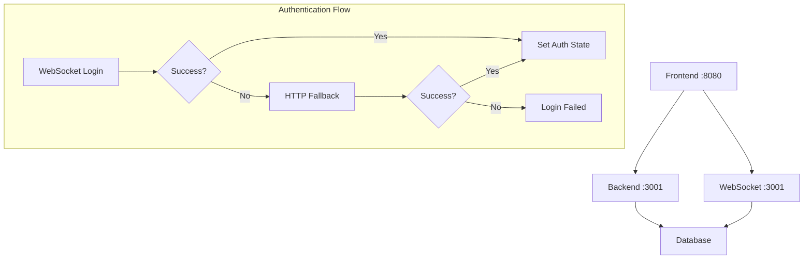
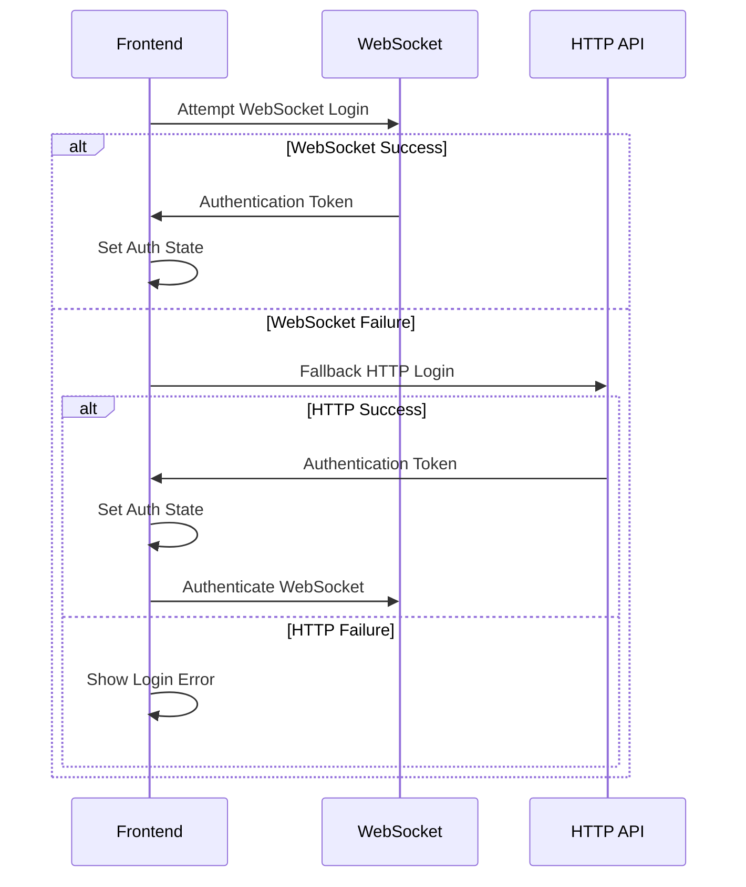

# Design Document

## Overview

This design addresses the WebSocket connection and CORS configuration issues in the CodeStorm application. The solution involves standardizing port configurations, updating CORS settings, and ensuring proper environment variable usage across both frontend and backend services.

## Architecture

The application uses a dual-protocol authentication system:
- **Primary**: WebSocket-based authentication for real-time features
- **Fallback**: HTTP-based authentication for reliability

## Components and Interfaces

### 1. Backend Configuration Updates

**File**: `backend/src/index.ts`
- Update CORS configuration to include port 8080
- Ensure consistent port usage from environment variables
- Add proper error handling for WebSocket connections

**File**: `backend/.env`
- Standardize port configuration
- Add frontend origin to CORS settings

### 2. Frontend Configuration Updates

**File**: `src/lib/api.ts`
- Update API base URL to use correct backend port (3001)
- Add proper error handling for CORS failures

**File**: `src/lib/websocket.ts`
- Update WebSocket URL to use correct backend port (3001)
- Improve connection error handling and fallback logic

**File**: `src/contexts/AuthContext.tsx`
- Fix authentication response handling
- Improve error handling for WebSocket authentication failures

### 3. Environment Configuration

**Frontend Environment Variables**:
- `VITE_API_BASE_URL`: Backend API endpoint
- `VITE_BACKEND_HOST`: WebSocket connection host

**Backend Environment Variables**:
- `PORT`: Server port (3001)
- `CORS_ORIGIN`: Allowed frontend origins

## Data Models

No new data models are required. The existing authentication models remain unchanged:
- User authentication tokens
- WebSocket message formats
- API response structures

## Error Handling

### WebSocket Connection Errors
1. **Connection Timeout**: Retry with exponential backoff
2. **Authentication Failure**: Fall back to HTTP authentication
3. **CORS Errors**: Log detailed error information for debugging

### HTTP Request Errors
1. **CORS Failures**: Provide clear error messages
2. **Network Errors**: Implement retry logic with user feedback
3. **Authentication Errors**: Clear invalid tokens and redirect to login

### Fallback Strategy

## Testing Strategy

### Unit Tests
- Test CORS configuration with different origins
- Test WebSocket connection with various error scenarios
- Test authentication fallback logic

### Integration Tests
- Test complete authentication flow (WebSocket + HTTP)
- Test cross-origin requests from frontend to backend
- Test WebSocket reconnection scenarios

### Manual Testing
- Verify login works from frontend on port 8080
- Verify WebSocket connection establishes successfully
- Verify no CORS errors in browser console
- Test authentication persistence across page refreshes